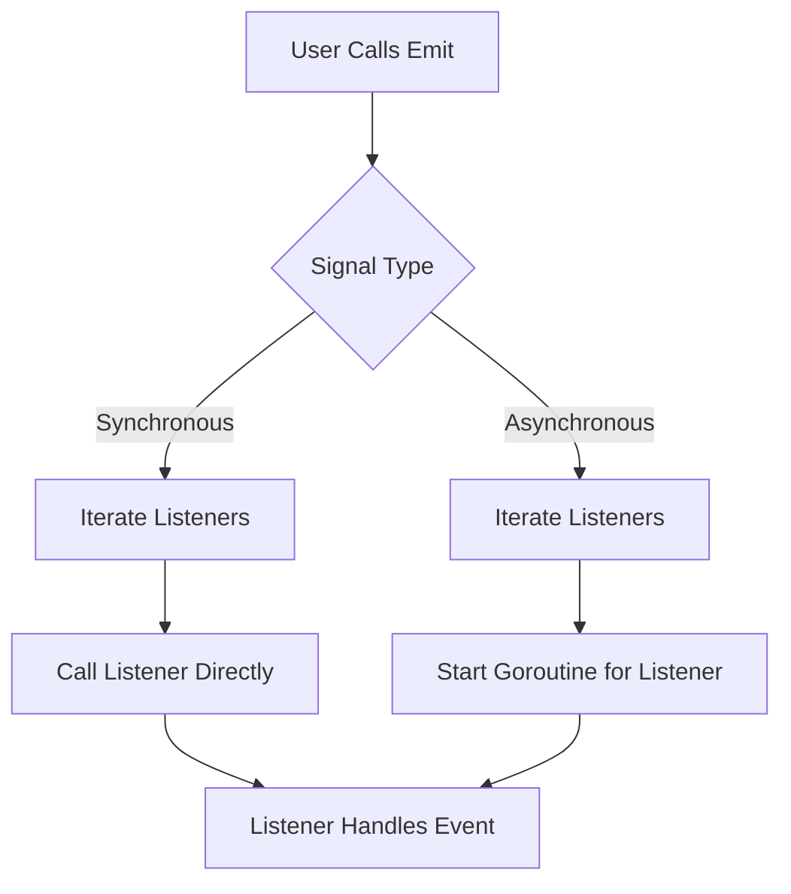

# Architecture

This document explains the internal architecture and flow of the **signals** library.

## Overview

The library is designed around the signal-slot (observer) pattern, providing both synchronous and asynchronous event dispatching with minimal overhead.

## Core Components

- **Signal**: Manages a list of listeners and emits events to them.
- **AsyncSignal**: Like `Signal`, but dispatches events in separate goroutines.
- **Listener**: A function or method that reacts to emitted events.

## Flow Diagram

## Extensibility

- Signals can be extended for custom behaviors (e.g., filtering, transformation).
- Listeners can be dynamically added or removed.

## Thread Safety

- Synchronous signals are safe for concurrent use if listeners are not modified during emission.
- Asynchronous signals use goroutines for non-blocking dispatch.

---

- [Introduction](introduction.md)
- [Getting Started](getting_started.md)
- [Concepts](concepts.md)
- [API Reference](api_reference.md)
