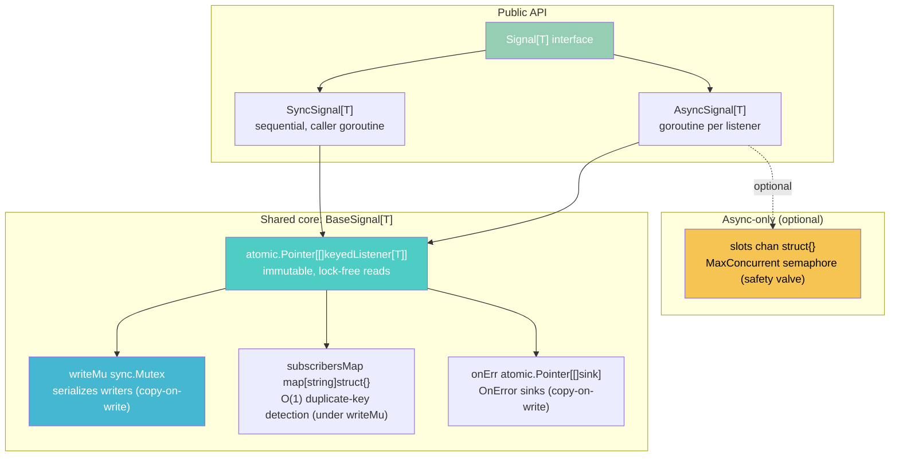

# Architecture & Performance

A deep dive into the real v1.4 design of `github.com/maniartech/signals`: a
lock-free, copy-on-write listener registry with a synchronous (sequential) and an
asynchronous (goroutine-per-listener) emission strategy on top of it.

This document describes what the code actually does. Where it claims a performance
number, that number comes from the repository's benchmark suite under the stated
conditions (see [Benchmarks](#benchmarks)). There are no hidden worker pools,
`sync.Pool`s, task queues, or `RWMutex`es in this library — earlier revisions of
this page described an architecture that was never built.

## What the design is (in one paragraph)

Listeners are stored as an **immutable slice** behind an `atomic.Pointer`. Every
emit is a **single atomic load** of that slice followed by a direct iteration —
**no lock, no per-emit copy, no allocation on the read path**. Writes
(`AddListener`/`RemoveListener`/`Reset`) serialize on a `sync.Mutex`, build a
**brand-new** slice (copy-on-write), and atomically swap it in. Because a published
slice is never mutated again, a reader iterating an old slice is completely
unaffected by a concurrent writer. `SyncSignal` runs listeners sequentially in the
caller's goroutine; `AsyncSignal` runs each listener in its own goroutine, with an
optional counting semaphore (`MaxConcurrent`) to cap concurrency.

## Core Architecture Overview


```mermaid
graph TB
    subgraph "Public API"
        API["Signal[T] interface"]
        SYNC["SyncSignal[T]<br/>sequential, caller goroutine"]
        ASYNC["AsyncSignal[T]<br/>goroutine per listener"]
    end

    subgraph "Shared core: BaseSignal[T]"
        PTR["atomic.Pointer[[]keyedListener[T]]<br/>immutable, lock-free reads"]
        WMU["writeMu sync.Mutex<br/>serializes writers (copy-on-write)"]
        SMAP["subscribersMap map[string]struct{}<br/>O(1) duplicate-key detection (under writeMu)"]
        ONERR["onErr atomic.Pointer[[]sink]<br/>OnError sinks (copy-on-write)"]
    end

    subgraph "Async-only (optional)"
        SEM["slots chan struct{}<br/>MaxConcurrent semaphore (safety valve)"]
    end

    API --> SYNC
    API --> ASYNC
    SYNC --> PTR
    ASYNC --> PTR
    PTR --> WMU
    PTR --> SMAP
    PTR --> ONERR
    ASYNC -.optional.-> SEM

    style PTR fill:#4ecdc4,color:#fff
    style WMU fill:#45b7d1,color:#fff
    style API fill:#96ceb4,color:#fff
    style SEM fill:#f6c453,color:#000
```

There is deliberately **no** `sync.Pool`, **no** worker pool, **no** `RWMutex`, and
**no** async task queue. The only synchronization primitives are the `atomic.Pointer`
that publishes the listener slice, the `writeMu` that serializes writers, and the
optional `slots` semaphore on async signals.

## The core: lock-free reads, locked writes (copy-on-write)

`BaseSignal[T]` is the shared implementation embedded (by composition) in both
`SyncSignal[T]` and `AsyncSignal[T]`. Its listener registry is the heart of the
library.

```go
type BaseSignal[T any] struct {
    // writeMu serializes writers (AddListener/RemoveListener/Reset).
    // Readers NEVER take this lock.
    writeMu sync.Mutex

    // subs holds the current immutable subscriber slice. Readers load it
    // atomically and iterate without copying; writers swap in a fresh slice.
    subs atomic.Pointer[[]keyedListener[T]]

    // subscribersMap gives O(1) duplicate-key detection.
    // Only touched while holding writeMu, so it needs no separate locking.
    subscribersMap map[string]struct{}

    // growthFunc decides capacity when the slice must grow (prime sequence).
    growthFunc func(currentCap int) int

    // onErr holds OnError sinks, also published copy-on-write behind an
    // atomic pointer so error routing is lock-free.
    onErr   atomic.Pointer[[]func(context.Context, error)]
    onErrMu sync.Mutex
}
```

A `keyedListener[T]` pairs a listener with an optional key. It can hold either a
plain listener or an error-returning listener (used by `TryEmit` and `OnError`).

### The read path (every Emit / TryEmit / dispatch)

Reading the listener set is a single atomic load. The slice it returns is immutable,
so it can be iterated directly with no lock and no defensive copy:

```go
// load() is the read primitive for every emit path.
func (s *BaseSignal[T]) load() []keyedListener[T] {
    if p := s.subs.Load(); p != nil {
        return *p
    }
    return nil
}
```

Why this is safe without a lock:

- A published slice is **never mutated** after it is stored. Writers always build a
  new backing array, so a reader iterating an older slice cannot observe a torn or
  partially-updated state.
- The `atomic.Pointer` load/store pair establishes the **happens-before**
  relationship: whatever a writer did before `subs.Store(&newSlice)` is visible to a
  reader that observes that store via `subs.Load()`.
- Readers never block writers, and readers never block each other. Concurrent emits
  scale nearly linearly with cores.

This is the reason the synchronous read path is **0 allocations** and runs in
single-digit nanoseconds (see [Benchmarks](#benchmarks)).

### The write path (Add / Remove / Reset) — copy-on-write, O(n)

Writers take `writeMu`, build a fresh slice, and atomically swap it in. Writes are
O(n) by design — copy-on-write trades write cost for lock-free reads, which is the
right trade for an event library where emits vastly outnumber subscription changes.

```go
// add appends a listener using copy-on-write under the write mutex.
func (s *BaseSignal[T]) add(kl keyedListener[T]) int {
    s.writeMu.Lock()
    defer s.writeMu.Unlock()

    if kl.keyed { // duplicate-key detection is O(1) via the map
        if _, ok := s.subscribersMap[kl.key]; ok {
            return -1 // duplicate key: nothing added
        }
    }

    old := s.load()
    dup := s.cloneForWrite(old, 1) // fresh backing array, honoring growthFunc
    dup = append(dup, kl)
    if kl.keyed {
        s.subscribersMap[kl.key] = struct{}{}
    }
    s.subs.Store(&dup) // atomic publish — readers see the new slice or the old, never a mix
    return len(dup)
}
```

`RemoveListener` uses a **swap-remove** inside the freshly copied slice: it moves the
last element into the removed slot and truncates. That makes removal O(1) within the
new slice but **reorders** the remaining listeners (registration order is not
preserved after a removal). The duplicate-key map is updated under the same lock.

`Reset` simply publishes a new empty slice and a new empty map.

The returned `int` from every `Add*` call is a **count of subscribers** (or `-1` on a
duplicate key) — **not a position**. There is no remove-by-index; removal is by key
only. Register a listener with a key to remove it later; unkeyed listeners can only be
cleared via `Reset`.

### Concurrency contract

- **Happens-before** is established solely by atomic-pointer publication of the
  listener slice (and, separately, the `OnError` sink slice).
- Readers never block writers or one another.
- The library synchronizes **only the listener set**. It makes **no** guarantees
  about the payload you pass or about state your listeners capture and mutate — that
  is the caller's responsibility. If two async listeners touch shared state, you must
  synchronize that state yourself.

## Prime-based growth

When the subscriber slice must grow, capacity follows a **prime-number sequence**.
Prime sizing helps reduce clustering in hash-based structures and tends to spread
reallocation points out. Both the initial capacity and the growth function are
configurable via `SignalOptions`.

```go
// Default starting capacity (a prime).
var defaultInitialCapacity = 11

// Default growth sequence (truncated here; the real slice runs to ~2.1 billion).
var defaultPrimes = []int{11, 17, 23, 31, 47, 67, 97, 127, 197, 257, /* ... */ 2147483647}

// defaultGrowthFunc returns the next prime larger than the current capacity,
// falling back to doubling-plus-one past the end of the table.
func defaultGrowthFunc(currentCap int) int {
    for _, p := range defaultPrimes {
        if p > currentCap {
            return p
        }
    }
    return currentCap*2 + 1
}
```

Customize it through `SignalOptions`:

```go
sig := signals.NewWithOptions[Order](&signals.SignalOptions{
    InitialCapacity: 64,                               // pre-size for a known listener count
    GrowthFunc:      func(c int) int { return c * 2 }, // your own growth policy
})
```

`InitialCapacity` defaults to 11; a non-positive value falls back to the default. A
`nil` `GrowthFunc` uses the prime sequence above. These options apply to both sync
and async signals (`NewWithOptions` / `NewSyncWithOptions`).

## SyncSignal: sequential, in the caller's goroutine

`SyncSignal[T]` invokes listeners **one at a time, in order, on the calling
goroutine**. `Emit` blocks until every listener has run. It is the right choice when
you need ordering, completion-before-return, or no goroutine overhead.

`Emit` is **best-effort**: if an error-returning listener (added with
`AddListenerWithErr`) returns an error, that error is routed to the `OnError` sinks
and the chain **continues**.

```go
func (s *SyncSignal[T]) Emit(ctx context.Context, payload T) {
    s.ensureBase()
    if ctx != nil && ctx.Err() != nil {
        return // already canceled
    }
    // Lock-free read: a single atomic load of the immutable slice. No copy.
    subscribers := s.baseSignal.load()
    for i := range subscribers {
        if ctx != nil && ctx.Err() != nil {
            break // stop invoking further listeners on cancellation
        }
        sub := &subscribers[i]
        if sub.listenerErr != nil {
            if err := sub.listenerErr(ctx, payload); err != nil {
                s.baseSignal.routeError(ctx, err) // best-effort: route, then continue
            }
            continue
        }
        if sub.listener != nil {
            sub.listener(ctx, payload)
        }
    }
}
```

`TryEmit` is **transactional**: it runs listeners in order and **stops at the first
error or canceled context**, returning that error. Use it when later steps must not
run if an earlier one fails.

```go
err := sig.TryEmit(ctx, payload) // nil iff every listener succeeded, else the first error
```

Note: panics from sync listeners are **not** recovered by the library — they
propagate to the `Emit`/`TryEmit` caller, exactly like a normal function call. (Panic
recovery applies to async listeners; see below.)

## AsyncSignal: a goroutine per listener (+ optional semaphore)

`AsyncSignal[T]` runs each listener in its **own goroutine**, so listeners execute
concurrently.

### Emit is fire-and-forget

`Emit` snapshots the listener slice at call time (a single atomic load), spawns **one
dispatcher goroutine**, and **returns immediately**. The dispatcher starts each
listener in its own goroutine.

```go
func (s *AsyncSignal[T]) Emit(ctx context.Context, payload T) {
    s.ensureBase()
    if ctx != nil && ctx.Err() != nil {
        return // already canceled: don't even spawn a dispatcher
    }
    // Snapshot at CALL time so a later Add/Remove/Reset doesn't change
    // what THIS emission delivers.
    subscribers := s.baseSignal.load()
    if len(subscribers) == 0 {
        return
    }
    go s.dispatch(ctx, payload, subscribers, nil, nil) // returns immediately
}
```

The cost the caller observes from `Emit` is the **dispatch rate** — the time to
snapshot and spawn — **not** the time for listeners to complete. Async emission
allocates (goroutine stacks and closures); it is **not** a zero-allocation path. Do
not attribute the sync path's single-digit-nanosecond, zero-allocation numbers to
async emission.

### TryEmit waits for all and joins errors

`TryEmit` runs all listeners concurrently, **waits for every one** (via a
`sync.WaitGroup`), and returns the `errors.Join` of every failure **in registration
order**. Unlike the sequential sync `TryEmit`, it cannot stop-on-first across
goroutines — all listeners run.

It is **context-aware**: if `ctx` is canceled or its deadline passes while listeners
are still running, `TryEmit` returns `ctx.Err()` promptly instead of blocking on a
slow listener. The guaranteed property is **caller liveness** — Go cannot force-cancel
a running goroutine, so a detached listener may keep running in the background.

```go
// Wait for all async listeners, collect every error.
if err := sig.TryEmit(ctx, payload); err != nil {
    // err is errors.Join(...) of all failures, or ctx.Err() if the deadline hit
}
```

### Optional bounding: the MaxConcurrent semaphore

By default async dispatch is **unbounded** — one goroutine per listener. Setting
`SignalOptions.MaxConcurrent > 0` installs a **counting semaphore** (`slots chan
struct{}`) that caps how many handler goroutines run **at once**. Excess handlers
**park** (nothing is dropped) until a slot frees.

```go
sig := signals.NewWithOptions[Job](&signals.SignalOptions{
    MaxConcurrent: 8, // at most 8 handlers run concurrently; the rest wait their turn
})
```

This is a **safety valve, not a worker pool and not a throughput optimization**:

- It exists to protect a constrained downstream resource (e.g. a database connection
  pool). Size it to the slowest dependency, never to the listener count.
- The benchmark data shows bounding is **slower** than unbounded for short listeners
  (the semaphore adds coordination overhead) — see [Benchmarks](#benchmarks).
- A bound can **starve** long-running listeners (only `MaxConcurrent` ever start),
  which is exactly why the default is unbounded.
- `Emit` still returns immediately; the parking happens inside the background
  dispatcher, not on the caller's goroutine.

`signals.DefaultMaxConcurrent()` returns `2 × runtime.NumCPU()` as a reasonable
**starting point** for I/O-bound listeners. It is **not applied automatically** — you
must opt in by setting the field.

### Panic isolation

Each async handler goroutine recovers panics so that one misbehaving listener cannot
crash the process or stop the others. Recovered panics are routed to a process-global
handler installed via `signals.SetPanicHandler` (the default logs via the standard
library `log` package). The semaphore slot is released on **every** exit path,
including a recovered panic — so a panicking handler can never leak or deadlock a
bounded signal's slots.

```go
signals.SetPanicHandler(func(recovered any) {
    metrics.Inc("listener_panics")
    log.Printf("listener panic: %v", recovered)
})
```

### Async dispatch flow

```mermaid
sequenceDiagram
    participant C as Caller
    participant A as AsyncSignal
    participant D as Dispatcher goroutine
    participant S as slots semaphore (optional)
    participant H as Handler goroutines

    C->>A: Emit(ctx, payload)
    A->>A: atomic load of listener snapshot
    A->>D: go dispatch(snapshot)
    A-->>C: return immediately (fire-and-forget)

    loop for each listener in snapshot
        D->>S: acquire slot (only if MaxConcurrent set; parks if full)
        D->>H: go handler(ctx, payload)
    end

    Note over H: each handler recovers panics → SetPanicHandler
    H->>S: release slot on every exit path (incl. panic)
```

## Error handling model

Both signal types expose the same error surface — `AddListenerWithErr`, `OnError`,
and `AddOnceWithErr` exist on **both** `SyncSignal` and `AsyncSignal`.

| Path | Sync | Async |
|------|------|-------|
| `Emit` | best-effort; listener errors routed to `OnError` sinks, chain continues | fire-and-forget; listener errors routed to `OnError` sinks on a handler goroutine |
| `TryEmit` | sequential; **stops at first error** and returns it | runs all, waits, returns `errors.Join` of all failures (or `ctx.Err()` on deadline) |

`OnError` sinks are published copy-on-write behind their own atomic pointer, so
routing an error is lock-free. A sink runs on the goroutine of the failing listener
(the caller's for sync, a handler goroutine for async), so keep sinks cheap and
non-blocking. A panic inside a sink is recovered and routed to the panic handler
without stopping the remaining sinks.

```go
sig := signals.New[Payment]()
sig.OnError(func(ctx context.Context, err error) {
    log.Printf("payment listener failed: %v", err)
})
sig.AddListenerWithErr(func(ctx context.Context, p Payment) error {
    return charge(ctx, p) // a non-nil error reaches the OnError sink on Emit
})
sig.Emit(ctx, payment) // fire-and-forget; errors surface via the sink
```

## API surface (v1.4)

Both `SyncSignal[T]` and `AsyncSignal[T]` satisfy the same `Signal[T]` interface
(enforced by compile-time assertions in `new.go`):

```go
Emit(ctx context.Context, payload T)
TryEmit(ctx context.Context, payload T) error
OnError(sink func(ctx context.Context, err error))
AddListener(handler SignalListener[T], key ...string) int
AddListenerWithErr(handler SignalListenerErr[T], key ...string) int
AddOnce(handler SignalListener[T], key ...string) int
AddOnceWithErr(handler SignalListenerErr[T], key ...string) int
RemoveListener(key string) int
Reset()
Len() int
IsEmpty() bool
Keys() []string
HasKey(key string) bool
```

Constructors: `New[T]()` (async), `NewSync[T]()` (sync), and the options variants
`NewWithOptions[T](opts)` / `NewSyncWithOptions[T](opts)`.

> Removed in v1.4: `EmitAndWait`, `EmitAndWaitErr`, and `AddOnceWithKey` no longer
> exist. To wait for async completion, use `TryEmit` (and ignore the result if you
> only need the wait). To add a keyed one-shot, pass the key to `AddOnce` /
> `AddOnceWithErr`.

## Benchmarks

These are the only authoritative performance numbers. They were measured on an
**AMD Ryzen 7 5700G, Windows**, with `go test -count=6`. Reproduce them yourself:

```bash
go test -run '^$' -bench=. -benchmem -count=6 ./tests/
```

### Sync — the lock-free, zero-allocation read path

| Scenario | Time | Allocations |
|----------|------|-------------|
| `Emit`, 1 listener | ~9 ns/op | 0 B, 0 allocs |
| `Emit`, 10 listeners | ~39 ns/op | 0 allocs |
| `Emit`, concurrent (16 goroutines) | ~1.3 ns/op | 0 allocs (near-linear scaling) |
| `TryEmit`, 1 listener | ~11 ns/op | 0 allocs |
| `Emit`, error routed to `OnError` | ~20 ns/op | 0 allocs |

The "sub-10 ns / zero-allocation" characterization applies **only** to this sync read
path. It is not a blanket property of the library.

### Async Emit — this is the *dispatch rate*, not listener completion

`Emit` returns after spawning goroutines; these numbers measure that spawn, **not** how
long listeners take to finish.

| Scenario | Time | Memory / Allocations |
|----------|------|----------------------|
| `Emit`, 1 listener | ~260 ns/op | 208 B, 2 allocs |
| `Emit`, 100 listeners | ~28 µs/op | ~11 KB, ~85 allocs |
| `Emit`, concurrent | ~475 ns/op | ~207 B, 1–2 allocs |

### Async TryEmit — waits for all listeners to finish

| Scenario | Time | Memory / Allocations |
|----------|------|----------------------|
| `TryEmit`, 10 listeners (unbounded) | ~6.5 µs/op | 1.5 KB, 12 allocs |
| `TryEmit`, 10 listeners, `MaxConcurrent=4` | ~9.2 µs/op | — |

The bounded run is **slower** than the unbounded one. Bounding is a safety valve, not
a speed-up.

### Write path — copy-on-write is O(n)

| Scenario | Time | Memory / Allocations |
|----------|------|----------------------|
| Add/Remove churn, ~1000 listeners, concurrent | ~30 µs/op | ~82 KB, 5 allocs |

Writes copy the whole slice; this is the deliberate cost that buys lock-free reads.

## Choosing a signal type

| You need… | Use |
|-----------|-----|
| Ordered, in-line execution; completion before `Emit` returns | `NewSync` |
| Transactional stop-on-first-error semantics | `NewSync` + `TryEmit` |
| Non-blocking emission; listeners do I/O | `New` (async) |
| To wait for all async listeners and collect every error | async + `TryEmit` |
| To cap concurrency against a constrained resource | async + `SignalOptions.MaxConcurrent` |

### Example: a small in-process event bus

```go
type EventBus struct {
    orders   signals.Signal[OrderEvent]   // async: fan out to independent handlers
    payments signals.Signal[PaymentEvent] // sync: ordered, transactional
}

func NewEventBus() *EventBus {
    return &EventBus{
        orders:   signals.New[OrderEvent](),
        payments: signals.NewSync[PaymentEvent](),
    }
}

func (b *EventBus) Wire() {
    // Independent async consumers (run concurrently, fire-and-forget).
    b.orders.AddListener(handleOrderForInventory, "inventory")
    b.orders.AddListener(handleOrderForShipping, "shipping")

    // Critical sequential chain: TryEmit stops at the first failure.
    b.payments.AddListenerWithErr(validatePayment, "validate")
    b.payments.AddListenerWithErr(capturePayment, "capture")
    b.payments.AddListenerWithErr(recordTransaction, "record")
}

func (b *EventBus) PlaceOrder(ctx context.Context, e OrderEvent) {
    b.orders.Emit(ctx, e) // returns immediately
}

func (b *EventBus) ProcessPayment(ctx context.Context, e PaymentEvent) error {
    return b.payments.TryEmit(ctx, e) // all-or-stop-on-first-error
}
```

## Architecture summary

| Component | Role | How it works |
|-----------|------|--------------|
| `BaseSignal[T]` | Shared listener registry | Immutable slice behind `atomic.Pointer`; lock-free reads, copy-on-write writes |
| `writeMu` | Writer serialization | `sync.Mutex` taken only by Add/Remove/Reset |
| `subscribersMap` | Duplicate-key detection | `map[string]struct{}` guarded by `writeMu`; swap-remove on delete |
| `SyncSignal[T]` | Sequential emission | Runs listeners in order on the caller's goroutine; `TryEmit` stops on first error |
| `AsyncSignal[T]` | Concurrent emission | Goroutine per listener; `Emit` fire-and-forget, `TryEmit` waits and joins errors |
| `slots` semaphore | Optional async bound | `MaxConcurrent` counting semaphore — a safety valve, not a worker pool |
| Prime growth | Capacity policy | Prime-number sequence, configurable via `SignalOptions` |

The design is intentionally small: lock-free reads on an immutable slice, copy-on-write
writes under a single mutex, and two thin emission strategies on top. Test coverage is
100%.

---

## Related documentation

| Topic | Link |
|-------|------|
| Getting started | [Getting Started](getting_started.md) |
| Core concepts | [Concepts](concepts.md) |
| API reference | [API Reference](api_reference.md) |
