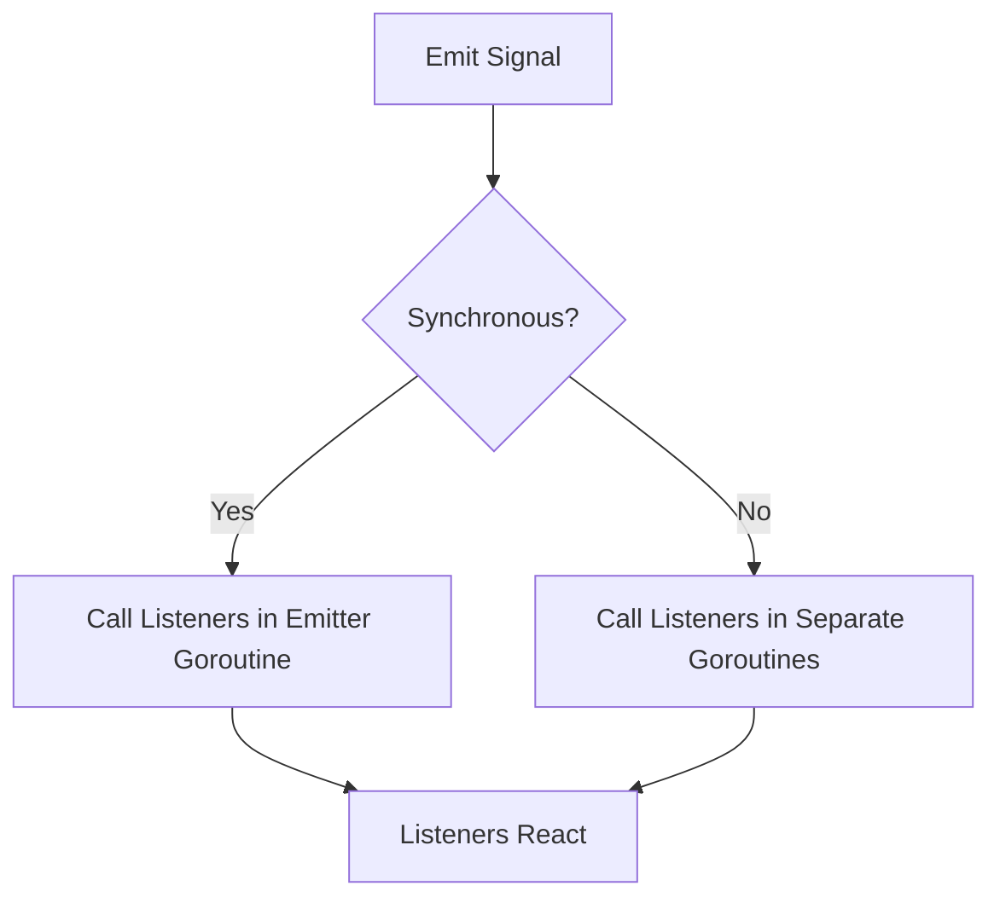

# Concepts

## Signals and Listeners

A **Signal** is an event broadcaster. **Listeners** (or slots) are functions that react to events. You can connect multiple listeners to a signal.

### Synchronous vs Asynchronous Signals
- **Synchronous**: Listeners are called in the same goroutine as the emitter.
- **Asynchronous**: Listeners are called in separate goroutines, allowing non-blocking event handling.

### Type Safety
Signals are generic, so you can define signals for any data type.


### Example: Synchronous Signal
```go
import (
    "context"
    "fmt"
    "github.com/maniartech/signals"
)

sig := signals.NewSync[int]()
sig.AddListener(func(ctx context.Context, n int) {
    fmt.Println(n)
})
sig.Emit(context.Background(), 42)
```

### Example: Asynchronous Signal
```go
import (
    "context"
    "fmt"
    "github.com/maniartech/signals"
)

sig := signals.New[string]()
sig.AddListener(func(ctx context.Context, msg string) {
    fmt.Println(msg)
})
sig.Emit(context.Background(), "async event")
```

## Flow Diagram



---

- [Introduction](introduction.md)
- [Getting Started](getting_started.md)
- [API Reference](api_reference.md)
