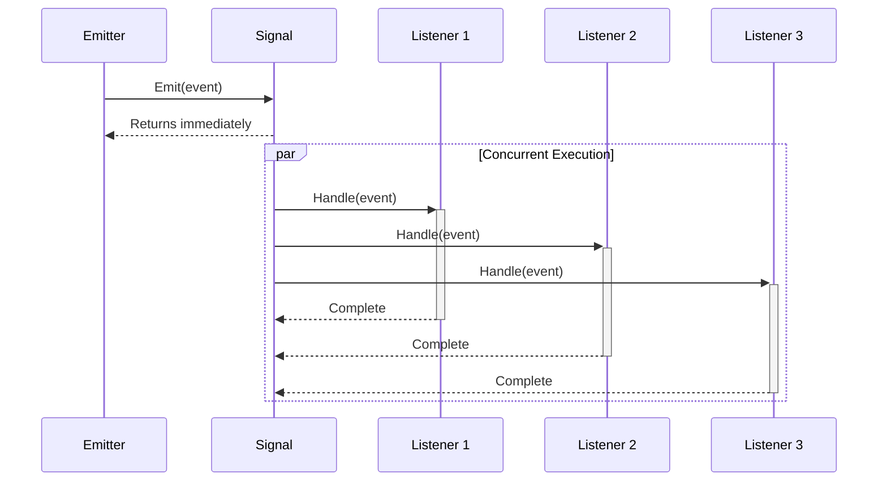
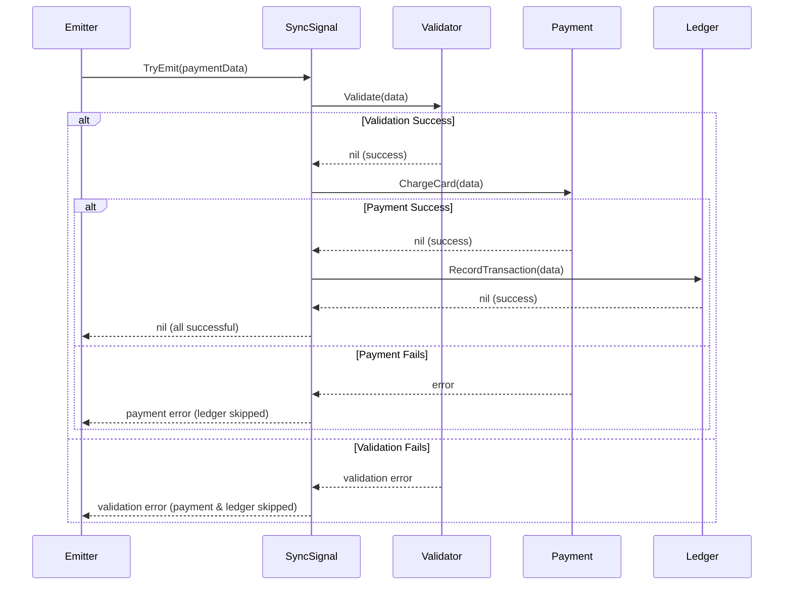

# 💡 Core Concepts & Design Patterns

> **Master the art of event-driven architecture with military-grade signal processing**

Understanding these core concepts will unlock the full potential of the Signals library and help you build robust, high-performance event systems.

## 🎯 Signal Types: Sync vs Async

### **AsyncSignal - Fire & Forget Pattern**
Perfect for notifications, logging, analytics, and non-critical events.

```go
// Create async signal (default behavior)
signal := signals.New[OrderEvent]()

// All listeners run concurrently in separate goroutines
signal.AddListener(inventory.UpdateStock)     // Goroutine 1
signal.AddListener(email.SendConfirmation)   // Goroutine 2
signal.AddListener(analytics.TrackPurchase)  // Goroutine 3
signal.AddListener(notifications.PushMobile) // Goroutine 4

// Non-blocking emit - returns immediately
signal.Emit(ctx, OrderEvent{ID: "order-123", Total: 99.99})
fmt.Println("Order processing started!") // Executes immediately
```

**Async Execution Flow:**


### **SyncSignal - Transaction & Error Pattern**
Perfect for critical workflows, transactions, validation chains.

```go
// Create sync signal for critical operations
workflow := signals.NewSync[PaymentData]()

// Sequential execution with error propagation
workflow.AddListenerWithErr(func(ctx context.Context, data PaymentData) error {
    return riskAnalysis.ValidateTransaction(data) // Step 1
})

workflow.AddListenerWithErr(func(ctx context.Context, data PaymentData) error {
    return paymentGateway.ChargeCard(data) // Step 2 (only if Step 1 succeeds)
})

workflow.AddListenerWithErr(func(ctx context.Context, data PaymentData) error {
    return ledger.RecordTransaction(data) // Step 3 (only if Step 2 succeeds)
})

// Blocking emit with error handling
if err := workflow.TryEmit(ctx, paymentData); err != nil {
    // If any step fails, subsequent steps are skipped
    log.Error("Payment failed", "error", err)
    return rollback(paymentData)
}
```

**Sync Execution Flow:**


## 🏗️ Advanced Design Patterns

### **1. Event Aggregation Pattern**
Combine multiple event sources into unified streams:

```go
type EventAggregator struct {
    userEvents    signals.Signal[UserEvent]
    orderEvents   signals.Signal[OrderEvent]
    systemEvents  signals.Signal[SystemEvent]

    // Unified output
    allEvents     signals.Signal[interface{}]
}

func (ea *EventAggregator) Setup() {
    // Forward all user events to unified stream
    ea.userEvents.AddListener(func(ctx context.Context, event UserEvent) {
        ea.allEvents.Emit(ctx, event)
    })

    // Forward all order events to unified stream
    ea.orderEvents.AddListener(func(ctx context.Context, event OrderEvent) {
        ea.allEvents.Emit(ctx, event)
    })

    // Forward all system events to unified stream
    ea.systemEvents.AddListener(func(ctx context.Context, event SystemEvent) {
        ea.allEvents.Emit(ctx, event)
    })
}
```

### **2. Circuit Breaker Pattern**
Protect downstream services with failure detection:

```go
type CircuitBreakerListener struct {
    failures    int
    threshold   int
    isOpen      bool
    resetTime   time.Time
}

func (cb *CircuitBreakerListener) HandleEvent(ctx context.Context, event APIEvent) error {
    if cb.isOpen {
        if time.Now().Before(cb.resetTime) {
            return errors.New("circuit breaker is open")
        }
        cb.isOpen = false // Try to reset
        cb.failures = 0
    }

    err := externalAPI.Process(ctx, event)
    if err != nil {
        cb.failures++
        if cb.failures >= cb.threshold {
            cb.isOpen = true
            cb.resetTime = time.Now().Add(30 * time.Second)
        }
        return err
    }

    cb.failures = 0 // Reset on success
    return nil
}
```

### **3. Saga Pattern for Distributed Transactions**
Coordinate complex multi-step workflows:

```go
type OrderSaga struct {
    steps []SagaStep
    signal signals.Signal[SagaEvent]
}

type SagaStep struct {
    Name     string
    Execute  func(context.Context, OrderData) error
    Rollback func(context.Context, OrderData) error
}

func (saga *OrderSaga) Execute(ctx context.Context, order OrderData) error {
    completedSteps := []int{}

    for i, step := range saga.steps {
        // Emit progress event
        saga.signal.Emit(ctx, SagaEvent{
            OrderID: order.ID,
            Step:    step.Name,
            Status:  "executing",
        })

        if err := step.Execute(ctx, order); err != nil {
            // Rollback completed steps in reverse order
            for j := len(completedSteps) - 1; j >= 0; j-- {
                stepIndex := completedSteps[j]
                saga.steps[stepIndex].Rollback(ctx, order)
            }

            saga.signal.Emit(ctx, SagaEvent{
                OrderID: order.ID,
                Status:  "failed",
                Error:   err.Error(),
            })
            return err
        }

        completedSteps = append(completedSteps, i)
    }

    saga.signal.Emit(ctx, SagaEvent{
        OrderID: order.ID,
        Status:  "completed",
    })
    return nil
}
```

## 🎖️ Production Design Patterns

### **Observability & Monitoring**
```go
// Metrics collection pattern
type MetricsCollector struct {
    emitCounter   *prometheus.CounterVec
    latencyHist   *prometheus.HistogramVec
    errorCounter  *prometheus.CounterVec
}

func (mc *MetricsCollector) WrapSignal(signal signals.Signal[Event]) {
    signal.AddListener(func(ctx context.Context, event Event) {
        start := time.Now()
        defer func() {
            duration := time.Since(start)
            mc.latencyHist.WithLabelValues(event.Type).Observe(duration.Seconds())
            mc.emitCounter.WithLabelValues(event.Type, "success").Inc()
        }()

        // Process event
        if err := processEvent(ctx, event); err != nil {
            mc.errorCounter.WithLabelValues(event.Type, err.Error()).Inc()
        }
    })
}
```

### **Rate Limiting & Backpressure**
```go
type RateLimitedSignal struct {
    signal   signals.Signal[Event]
    limiter  *rate.Limiter
    queue    chan Event
}

func NewRateLimitedSignal(rps int, burst int) *RateLimitedSignal {
    rls := &RateLimitedSignal{
        signal:  signals.New[Event](),
        limiter: rate.NewLimiter(rate.Limit(rps), burst),
        queue:   make(chan Event, 1000), // Buffer for backpressure
    }

    // Background processor respecting rate limits
    go func() {
        for event := range rls.queue {
            // Wait for rate limiter
            if err := rls.limiter.Wait(context.Background()); err != nil {
                continue
            }
            rls.signal.Emit(context.Background(), event)
        }
    }()

    return rls
}

func (rls *RateLimitedSignal) EmitWithBackpressure(event Event) error {
    select {
    case rls.queue <- event:
        return nil
    default:
        return errors.New("queue full - backpressure applied")
    }
}
```

### **Event Sourcing Pattern**
```go
type EventStore struct {
    events  []StoredEvent
    signal  signals.Signal[StoredEvent]
    mu      sync.RWMutex
}

type StoredEvent struct {
    ID        string    `json:"id"`
    Type      string    `json:"type"`
    Data      []byte    `json:"data"`
    Timestamp time.Time `json:"timestamp"`
    Version   int       `json:"version"`
}

func (es *EventStore) Append(eventType string, data interface{}) error {
    es.mu.Lock()
    defer es.mu.Unlock()

    eventData, _ := json.Marshal(data)
    event := StoredEvent{
        ID:        uuid.New().String(),
        Type:      eventType,
        Data:      eventData,
        Timestamp: time.Now(),
        Version:   len(es.events) + 1,
    }

    es.events = append(es.events, event)

    // Notify subscribers of new event
    go es.signal.Emit(context.Background(), event)

    return nil
}

func (es *EventStore) Replay(fromVersion int) {
    es.mu.RLock()
    defer es.mu.RUnlock()

    for _, event := range es.events[fromVersion:] {
        es.signal.Emit(context.Background(), event)
    }
}
```

## 🌍 Practical Inter-Process Communication Examples

### **1. Cross-Package Event Coordination**
Coordinate events between different packages in your application:

```go
// events/signals.go - Centralized event definitions
package events

import "github.com/maniartech/signals"

// Global signals for cross-package communication
var (
    UserCreated    = signals.New[UserEvent]()
    UserUpdated    = signals.New[UserEvent]()
    UserDeleted    = signals.New[UserEvent]()

    DBTransaction  = signals.NewSync[TransactionEvent]()
    RequestLogged  = signals.Signal[RequestEvent]()
)

type UserEvent struct {
    ID       string `json:"id"`
    Email    string `json:"email"`
    Action   string `json:"action"`
    Changes  map[string]interface{} `json:"changes,omitempty"`
}

type TransactionEvent struct {
    Operation string      `json:"operation"`
    Table     string      `json:"table"`
    Data      interface{} `json:"data"`
    UserID    string      `json:"user_id"`
}
```

```go
// auth/service.go - Auth package listens and emits events
package auth

import (
    "context"
    "myapp/events"
    "myapp/audit"
    "myapp/cache"
)

func init() {
    // Listen for user events from other packages
    events.UserCreated.AddListener(func(ctx context.Context, user events.UserEvent) {
        // Clear auth caches when user is created
        cache.InvalidateUser(user.ID)
        audit.LogUserAction(user.ID, "account_created")
    }, "auth-cache-invalidation")

    events.UserDeleted.AddListener(func(ctx context.Context, user events.UserEvent) {
        // Cleanup auth tokens when user deleted
        tokenStore.RevokeAllTokens(user.ID)
        sessionStore.ClearUserSessions(user.ID)
    }, "auth-cleanup")
}

func CreateUser(ctx context.Context, email, password string) (*User, error) {
    user, err := db.CreateUser(email, password)
    if err != nil {
        return nil, err
    }

    // Emit event for other packages to handle
    go events.UserCreated.Emit(ctx, events.UserEvent{
        ID:     user.ID,
        Email:  user.Email,
        Action: "created",
    })

    return user, nil
}
```

```go
// notifications/service.go - Notifications package responds to events
package notifications

import (
    "context"
    "myapp/events"
    "myapp/email"
)

func init() {
    // React to user events from auth package
    events.UserCreated.AddListener(func(ctx context.Context, user events.UserEvent) {
        email.SendWelcomeEmail(user.Email)
    }, "welcome-email")

    events.UserUpdated.AddListener(func(ctx context.Context, user events.UserEvent) {
        if emailChanged := user.Changes["email"]; emailChanged != nil {
            email.SendEmailChangeNotification(user.Email)
        }
    }, "email-change-notification")
}
```

### **2. Database Transaction Cancellation**
Cancel database operations when business logic fails:

```go
// db/transaction.go - Database package with cancellation support
package db

import (
    "context"
    "database/sql"
    "myapp/events"
)

type TransactionManager struct {
    db *sql.DB
}

func (tm *TransactionManager) init() {
    // Listen for transaction events that might need cancellation
    events.DBTransaction.AddListenerWithErr(func(ctx context.Context, event events.TransactionEvent) error {
        // Validate transaction before committing
        return tm.validateTransaction(ctx, event)
    }, "transaction-validator")
}

func (tm *TransactionManager) ExecuteTransaction(ctx context.Context, operations []Operation) error {
    tx, err := tm.db.BeginTx(ctx, nil)
    if err != nil {
        return err
    }

    // Setup cancellation context
    ctx, cancel := context.WithCancel(ctx)
    defer cancel()

    // Rollback on any error or cancellation
    defer func() {
        if ctx.Err() != nil || recover() != nil {
            tx.Rollback()
        }
    }()

    for _, op := range operations {
        // Check for cancellation before each operation
        select {
        case <-ctx.Done():
            return ctx.Err() // Transaction cancelled
        default:
        }

        // Execute operation
        if err := op.Execute(tx); err != nil {
            cancel() // Cancel context to signal rollback
            return err
        }

        // Emit transaction event for validation
        if err := events.DBTransaction.TryEmit(ctx, events.TransactionEvent{
            Operation: op.Type,
            Table:     op.Table,
            Data:      op.Data,
            UserID:    op.UserID,
        }); err != nil {
            cancel() // Validator failed - cancel transaction
            return fmt.Errorf("transaction validation failed: %w", err)
        }
    }

    return tx.Commit()
}
```

```go
// audit/validator.go - Audit package validates transactions
package audit

func init() {
    events.DBTransaction.AddListenerWithErr(func(ctx context.Context, event events.TransactionEvent) error {
        // Check if user has permission for this operation
        if !permissions.UserCanModify(event.UserID, event.Table) {
            return fmt.Errorf("user %s not authorized for %s on %s",
                event.UserID, event.Operation, event.Table)
        }

        // Check business rules
        if event.Operation == "delete" && event.Table == "users" {
            return fmt.Errorf("user deletion not allowed via transaction")
        }

        return nil
    }, "audit-permissions")
}
```

### **3. Change History Tracking During Updates**
Track what changes when database records are updated:

```go
// history/tracker.go - Change tracking system
package history

import (
    "context"
    "encoding/json"
    "myapp/events"
    "myapp/db"
)

type ChangeRecord struct {
    ID        string    `json:"id"`
    Table     string    `json:"table"`
    RecordID  string    `json:"record_id"`
    UserID    string    `json:"user_id"`
    Before    string    `json:"before"`     // JSON of old values
    After     string    `json:"after"`      // JSON of new values
    Changes   []string  `json:"changes"`    // List of changed fields
    Timestamp time.Time `json:"timestamp"`
}

func init() {
    // Track all database changes
    events.DBTransaction.AddListener(func(ctx context.Context, event events.TransactionEvent) {
        if event.Operation == "update" {
            go trackChanges(ctx, event)
        }
    }, "change-tracker")
}

func trackChanges(ctx context.Context, event events.TransactionEvent) {
    // Get the before state
    before, err := db.GetRecordSnapshot(event.Table, event.Data["id"].(string))
    if err != nil {
        log.Error("Failed to get before snapshot", "error", err)
        return
    }

    // Compare before and after
    changes := compareRecords(before, event.Data)

    if len(changes) > 0 {
        beforeJSON, _ := json.Marshal(before)
        afterJSON, _ := json.Marshal(event.Data)

        changeRecord := ChangeRecord{
            ID:        generateID(),
            Table:     event.Table,
            RecordID:  event.Data["id"].(string),
            UserID:    event.UserID,
            Before:    string(beforeJSON),
            After:     string(afterJSON),
            Changes:   changes,
            Timestamp: time.Now(),
        }

        // Store change history
        if err := db.SaveChangeRecord(changeRecord); err != nil {
            log.Error("Failed to save change record", "error", err)
        }
    }
}

func compareRecords(before, after map[string]interface{}) []string {
    var changes []string

    for key, afterVal := range after {
        if beforeVal, exists := before[key]; exists {
            if !reflect.DeepEqual(beforeVal, afterVal) {
                changes = append(changes, key)
            }
        } else {
            changes = append(changes, key) // New field
        }
    }

    return changes
}
```

### **4. Request Logging Across HTTP Handlers**
Log HTTP requests across different handler packages:

```go
// middleware/logging.go - HTTP middleware with event emission
package middleware

import (
    "context"
    "myapp/events"
    "net/http"
    "time"
)

type RequestEvent struct {
    RequestID string            `json:"request_id"`
    Method    string            `json:"method"`
    Path      string            `json:"path"`
    UserID    string            `json:"user_id,omitempty"`
    Headers   map[string]string `json:"headers"`
    Body      string            `json:"body,omitempty"`
    StartTime time.Time         `json:"start_time"`
    Duration  time.Duration     `json:"duration,omitempty"`
    Status    int               `json:"status,omitempty"`
}

func LoggingMiddleware(next http.Handler) http.Handler {
    return http.HandlerFunc(func(w http.ResponseWriter, r *http.Request) {
        requestID := generateRequestID()
        startTime := time.Now()

        // Add request ID to context
        ctx := context.WithValue(r.Context(), "request_id", requestID)
        r = r.WithContext(ctx)

        // Emit request started event
        go events.RequestLogged.Emit(ctx, RequestEvent{
            RequestID: requestID,
            Method:    r.Method,
            Path:      r.URL.Path,
            UserID:    getUserID(r),
            Headers:   getHeaders(r),
            StartTime: startTime,
        })

        // Wrap response writer to capture status
        wrapped := &responseWriter{ResponseWriter: w, statusCode: 200}

        // Execute handler
        next.ServeHTTP(wrapped, r)

        // Emit request completed event
        go events.RequestLogged.Emit(ctx, RequestEvent{
            RequestID: requestID,
            Duration:  time.Since(startTime),
            Status:    wrapped.statusCode,
        })
    })
}
```

```go
// logger/service.go - Centralized logging service
package logger

import (
    "context"
    "myapp/events"
    "log/slog"
)

var requestLogger *slog.Logger

func init() {
    requestLogger = slog.New(slog.NewJSONHandler(os.Stdout, nil))

    // Listen for request events from middleware
    events.RequestLogged.AddListener(func(ctx context.Context, event RequestEvent) {
        if event.Duration > 0 {
            // Request completed
            requestLogger.Info("HTTP Request Completed",
                "request_id", event.RequestID,
                "duration_ms", event.Duration.Milliseconds(),
                "status", event.Status,
            )
        } else {
            // Request started
            requestLogger.Info("HTTP Request Started",
                "request_id", event.RequestID,
                "method", event.Method,
                "path", event.Path,
                "user_id", event.UserID,
            )
        }
    }, "request-logger")
}
```

```go
// analytics/service.go - Analytics service tracking request patterns
package analytics

func init() {
    // Track request patterns
    events.RequestLogged.AddListener(func(ctx context.Context, event RequestEvent) {
        if event.Duration > 0 {
            // Track slow requests
            if event.Duration > 500*time.Millisecond {
                slowRequestCounter.Inc()

                // Alert if too many slow requests
                if getSlowRequestRate() > 0.1 { // 10% slow requests
                    alerting.SendSlowRequestAlert(event)
                }
            }

            // Track API usage by endpoint
            endpointUsage[event.Path]++

            // Track user activity
            if event.UserID != "" {
                userActivity[event.UserID] = time.Now()
            }
        }
    }, "analytics-tracker")
}
```

### **5. Cache Invalidation Coordination**
Coordinate cache invalidation across multiple cache layers:

```go
// cache/coordinator.go - Cache invalidation coordinator
package cache

import (
    "context"
    "myapp/events"
)

type CacheInvalidationEvent struct {
    CacheKey  string   `json:"cache_key"`
    Tags      []string `json:"tags"`
    Reason    string   `json:"reason"`
    UserID    string   `json:"user_id,omitempty"`
}

var CacheInvalidated = signals.New[CacheInvalidationEvent]()

func init() {
    // Listen for user events to invalidate user-related caches
    events.UserUpdated.AddListener(func(ctx context.Context, user events.UserEvent) {
        go CacheInvalidated.Emit(ctx, CacheInvalidationEvent{
            Tags:   []string{"user:" + user.ID, "users"},
            Reason: "user_updated",
            UserID: user.ID,
        })
    }, "user-cache-invalidation")

    // Listen for database transactions to invalidate related caches
    events.DBTransaction.AddListener(func(ctx context.Context, event events.TransactionEvent) {
        go CacheInvalidated.Emit(ctx, CacheInvalidationEvent{
            Tags:   []string{"table:" + event.Table},
            Reason: "db_" + event.Operation,
            UserID: event.UserID,
        })
    }, "db-cache-invalidation")
}
```

## 🎯 Best Practices & Guidelines

### **📋 Signal Selection Decision Tree**

```mermaid
flowchart TD
    A[Need to emit an event?] --> B{Can you handle failures?}

    B -->|No - Fire & Forget| C[AsyncSignal]
    B -->|Yes - Need validation| D{Sequential processing required?}

    D -->|Yes - Order matters| E[SyncSignal + TryEmit]
    D -->|No - Parallel OK| F{Partial failures acceptable?}

    F -->|Yes| C
    F -->|No - All or nothing| E

    C --> G[Use Emit() method<br/>Non-blocking execution]
    E --> H[Use TryEmit() method<br/>Error propagation]

    style C fill:#e8f5e8,stroke:#4caf50
    style E fill:#fff3e0,stroke:#ff9800
    style G fill:#e1f5fe,stroke:#2196f3
    style H fill:#fce4ec,stroke:#e91e63
```

### **🎯 Signal Type Selection Guide**

| **Scenario** | **Signal Type** | **Method** | **Reasoning** | **Example** |
|--------------|-----------------|------------|---------------|-------------|
| **User Notifications** | `AsyncSignal` | `Emit()` | Non-blocking, can fail silently | Email, SMS, push notifications |
| **Audit Logging** | `AsyncSignal` | `Emit()` | Background processing, high volume | Access logs, user actions |
| **Cache Invalidation** | `AsyncSignal` | `Emit()` | Eventually consistent, not critical | Redis, memcache clearing |
| **Metrics Collection** | `AsyncSignal` | `Emit()` | Fire-and-forget, performance critical | Prometheus, StatsD |
| **Database Validation** | `SyncSignal` | `TryEmit()` | Must complete before proceeding | Business rule validation |
| **Financial Transactions** | `SyncSignal` | `TryEmit()` | Zero tolerance for partial failures | Payment processing |
| **Authentication Flow** | `SyncSignal` | `TryEmit()` | Sequential checks required | Permission validation |
| **API Request Pipeline** | `SyncSignal` | `TryEmit()` | Context timeouts needed | Rate limiting, auth |
| **Batch Operations** | `AsyncSignal` | `Emit()` | Parallel processing beneficial | File uploads, image processing |
| **Event Sourcing** | `SyncSignal` | `TryEmit()` | Consistency critical | Event store writes |

### **🛡️ Error Handling Best Practices**

#### **1. Layered Error Handling Strategy**

```go
// Define custom error types for different layers
type ValidationError struct {
    Field   string `json:"field"`
    Message string `json:"message"`
    Code    string `json:"code"`
}

func (e ValidationError) Error() string {
    return fmt.Sprintf("validation failed for %s: %s (%s)", e.Field, e.Message, e.Code)
}

type BusinessLogicError struct {
    Operation string `json:"operation"`
    Reason    string `json:"reason"`
    Retryable bool   `json:"retryable"`
}

func (e BusinessLogicError) Error() string {
    return fmt.Sprintf("business logic error in %s: %s", e.Operation, e.Reason)
}

type SystemError struct {
    Service string `json:"service"`
    Cause   error  `json:"cause"`
}

func (e SystemError) Error() string {
    return fmt.Sprintf("system error in %s: %v", e.Service, e.Cause)
}
```

#### **2. Comprehensive Error Handling Pattern**

```go
func ProcessUserRegistration(ctx context.Context, user UserRegistrationData) error {
    workflow := signals.NewSync[UserRegistrationData]()

    // Layer 1: Input validation
    workflow.AddListenerWithErr(func(ctx context.Context, user UserRegistrationData) error {
        if user.Email == "" {
            return ValidationError{Field: "email", Message: "required", Code: "REQUIRED"}
        }
        if !isValidEmail(user.Email) {
            return ValidationError{Field: "email", Message: "invalid format", Code: "INVALID_FORMAT"}
        }
        return nil
    }, "input-validation")

    // Layer 2: Business logic validation
    workflow.AddListenerWithErr(func(ctx context.Context, user UserRegistrationData) error {
        exists, err := database.UserExists(ctx, user.Email)
        if err != nil {
            return SystemError{Service: "database", Cause: err}
        }
        if exists {
            return BusinessLogicError{
                Operation: "user_registration",
                Reason:    "email already registered",
                Retryable: false,
            }
        }
        return nil
    }, "business-validation")

    // Layer 3: System operations
    workflow.AddListenerWithErr(func(ctx context.Context, user UserRegistrationData) error {
        if err := database.CreateUser(ctx, user); err != nil {
            return SystemError{Service: "database", Cause: err}
        }
        return nil
    }, "user-creation")

    // Execute with comprehensive error handling
    if err := workflow.TryEmit(ctx, user); err != nil {
        return handleRegistrationError(err)
    }

    return nil
}

func handleRegistrationError(err error) error {
    var validationErr ValidationError
    var businessErr BusinessLogicError
    var systemErr SystemError

    switch {
    case errors.As(err, &validationErr):
        // Client error - return as-is for API response
        return fmt.Errorf("invalid input: %w", err)

    case errors.As(err, &businessErr):
        if businessErr.Retryable {
            // Log for retry mechanism
            log.Warn("Retryable business error", "error", err)
            return fmt.Errorf("temporary failure: %w", err)
        }
        return fmt.Errorf("business rule violation: %w", err)

    case errors.As(err, &systemErr):
        // Log for alerting
        log.Error("System error during registration", "service", systemErr.Service, "error", err)
        return fmt.Errorf("internal system error")

    case errors.Is(err, context.DeadlineExceeded):
        log.Warn("Registration timeout", "error", err)
        return fmt.Errorf("registration timeout - please try again")

    case errors.Is(err, context.Canceled):
        log.Info("Registration cancelled", "error", err)
        return fmt.Errorf("registration cancelled")

    default:
        log.Error("Unexpected registration error", "error", err)
        return fmt.Errorf("unexpected error during registration")
    }
}
```

#### **3. Context-Aware Error Handling**

```go
// Timeout and cancellation patterns
func ProcessWithDeadlines(ctx context.Context, data ProcessingData) error {
    // Set different timeouts for different operations
    validationCtx, validationCancel := context.WithTimeout(ctx, 2*time.Second)
    defer validationCancel()

    businessCtx, businessCancel := context.WithTimeout(ctx, 5*time.Second)
    defer businessCancel()

    persistenceCtx, persistenceCancel := context.WithTimeout(ctx, 10*time.Second)
    defer persistenceCancel()

    workflow := signals.NewSync[ProcessingData]()

    workflow.AddListenerWithErr(func(ctx context.Context, data ProcessingData) error {
        // Fast validation with short timeout
        select {
        case <-validationCtx.Done():
            return fmt.Errorf("validation timeout: %w", validationCtx.Err())
        default:
        }
        return fastValidation(data)
    }, "fast-validation")

    workflow.AddListenerWithErr(func(ctx context.Context, data ProcessingData) error {
        // Business logic with medium timeout
        select {
        case <-businessCtx.Done():
            return fmt.Errorf("business logic timeout: %w", businessCtx.Err())
        default:
        }
        return businessLogic(businessCtx, data)
    }, "business-logic")

    workflow.AddListenerWithErr(func(ctx context.Context, data ProcessingData) error {
        // Persistence with longer timeout
        select {
        case <-persistenceCtx.Done():
            return fmt.Errorf("persistence timeout: %w", persistenceCtx.Err())
        default:
        }
        return saveData(persistenceCtx, data)
    }, "persistence")

    return workflow.TryEmit(ctx, data)
}
```

### **⚡ Performance Optimization Patterns**

#### **1. Signal Pre-allocation Strategy**

```go
// ✅ Pre-allocate based on expected listener count
func NewOptimizedEventSystem() *EventSystem {
    return &EventSystem{
        // High-frequency events - pre-allocate generously
        RequestEvents: signals.NewWithOptions[RequestEvent](&signals.SignalOptions{
            InitialCapacity: 50,  // Many middleware listeners expected
        }),

        // Low-frequency events - use defaults
        UserEvents: signals.New[UserEvent](),

        // Critical events - optimize for performance
        SecurityEvents: signals.NewWithOptions[SecurityEvent](&signals.SignalOptions{
            InitialCapacity: 20,
            GrowthFunc: func(cap int) int {
                return cap * 2  // Aggressive growth for critical events
            },
        }),
    }
}
```

#### **2. Context Reuse Patterns**

```go
// ✅ Context reuse for high-frequency operations
type RequestProcessor struct {
    backgroundCtx context.Context  // Long-lived context
    userEvents    signals.Signal[UserEvent]
}

func (rp *RequestProcessor) ProcessRequests(requests []Request) {
    // Reuse background context for non-critical events
    for _, req := range requests {
        go rp.userEvents.Emit(rp.backgroundCtx, UserEvent{
            UserID:    req.UserID,
            Action:    req.Action,
            Timestamp: time.Now(),
        })
    }
}

// ✅ Context per operation for timeout-sensitive operations
func (rp *RequestProcessor) ProcessCriticalRequest(req CriticalRequest) error {
    // Create specific context with timeout
    ctx, cancel := context.WithTimeout(context.Background(), 30*time.Second)
    defer cancel()

    return rp.criticalWorkflow.TryEmit(ctx, req)
}
```

#### **3. Listener Management Patterns**

```go
// ✅ Dynamic listener management
type FeatureManager struct {
    userEvents signals.Signal[UserEvent]
    features   map[string]bool
    mu         sync.RWMutex
}

func (fm *FeatureManager) EnableFeature(name string, handler signals.SignalListener[UserEvent]) {
    fm.mu.Lock()
    defer fm.mu.Unlock()

    if fm.features[name] {
        return  // Already enabled
    }

    fm.userEvents.AddListener(handler, name)
    fm.features[name] = true
}

func (fm *FeatureManager) DisableFeature(name string) {
    fm.mu.Lock()
    defer fm.mu.Unlock()

    if !fm.features[name] {
        return  // Already disabled
    }

    fm.userEvents.RemoveListener(name)
    fm.features[name] = false
}
```

### **🔍 Monitoring and Observability**

#### **1. Event Metrics Collection**

```go
// Instrumented signal wrapper for monitoring
type InstrumentedSignal[T any] struct {
    signal      signals.Signal[T]
    emitCounter prometheus.Counter
    errorRate   prometheus.Counter
    latencyHist prometheus.Histogram
    name        string
}

func NewInstrumentedSignal[T any](name string) *InstrumentedSignal[T] {
    return &InstrumentedSignal[T]{
        signal: signals.New[T](),
        name:   name,
        emitCounter: prometheus.NewCounter(prometheus.CounterOpts{
            Name: fmt.Sprintf("%s_events_total", name),
            Help: "Total number of events emitted",
        }),
        errorRate: prometheus.NewCounter(prometheus.CounterOpts{
            Name: fmt.Sprintf("%s_errors_total", name),
            Help: "Total number of event processing errors",
        }),
        latencyHist: prometheus.NewHistogram(prometheus.HistogramOpts{
            Name: fmt.Sprintf("%s_processing_duration_seconds", name),
            Help: "Event processing duration in seconds",
        }),
    }
}

func (is *InstrumentedSignal[T]) EmitWithMetrics(ctx context.Context, data T) {
    start := time.Now()
    defer func() {
        duration := time.Since(start)
        is.emitCounter.Inc()
        is.latencyHist.Observe(duration.Seconds())
    }()

    is.signal.Emit(ctx, data)
}
```

#### **2. Error Tracking and Alerting**

```go
// Error tracking wrapper
type ErrorTrackingSignal[T any] struct {
    signal     signals.SyncSignal[T]
    errorStore ErrorStore
    alerter    Alerter
}

func (ets *ErrorTrackingSignal[T]) TryEmitWithTracking(ctx context.Context, data T) error {
    err := ets.signal.TryEmit(ctx, data)
    if err != nil {
        // Track error for analysis
        ets.errorStore.Record(ErrorRecord{
            Signal:    ets.name,
            Data:      data,
            Error:     err.Error(),
            Timestamp: time.Now(),
            Context:   getContextInfo(ctx),
        })

        // Alert on critical errors
        if isCriticalError(err) {
            ets.alerter.SendAlert(AlertInfo{
                Level:   "critical",
                Message: fmt.Sprintf("Critical error in signal %s: %v", ets.name, err),
                Context: getContextInfo(ctx),
            })
        }
    }
    return err
}
```

### **🚨 Common Pitfalls and How to Avoid Them**

#### **❌ Don't Do This:**

```go
// ❌ Wrong: Using sync signal for fire-and-forget
syncSignal := signals.NewSync[LogEvent]()
syncSignal.Emit(ctx, logEvent)  // Blocks unnecessarily

// ❌ Wrong: Ignoring TryEmit errors
syncSignal.TryEmit(ctx, criticalData)  // Silent failures!

// ❌ Wrong: Creating signals in hot paths
func handleRequest(w http.ResponseWriter, r *http.Request) {
    sig := signals.New[RequestEvent]()  // Creates new signal every request!
}

// ❌ Wrong: Not handling context cancellation
signal.AddListener(func(ctx context.Context, data Data) {
    for i := 0; i < 1000000; i++ {
        processItem(data.Items[i])  // Ignores cancellation
    }
})

// ❌ Wrong: Memory leak with listeners
for i := 0; i < 1000; i++ {
    signal.AddListener(createHandler(i))  // Accumulates without cleanup
}
```

#### **✅ Do This Instead:**

```go
// ✅ Right: Use async signal for fire-and-forget
asyncSignal := signals.New[LogEvent]()
asyncSignal.Emit(ctx, logEvent)  // Non-blocking

// ✅ Right: Always handle TryEmit errors
if err := syncSignal.TryEmit(ctx, criticalData); err != nil {
    log.Error("Critical operation failed", "error", err)
    return handleError(err)
}

// ✅ Right: Create signals at package/service level
var RequestSignal = signals.New[RequestEvent]()

func handleRequest(w http.ResponseWriter, r *http.Request) {
    RequestSignal.Emit(ctx, requestEvent)  // Reuse existing signal
}

// ✅ Right: Respect context cancellation
signal.AddListener(func(ctx context.Context, data Data) {
    for i, item := range data.Items {
        select {
        case <-ctx.Done():
            return  // Respect cancellation
        default:
        }
        processItem(item)
    }
})

// ✅ Right: Use keyed listeners with cleanup
for i := 0; i < 1000; i++ {
    key := fmt.Sprintf("handler-%d", i)
    signal.AddListener(createHandler(i), key)
}
defer func() {
    // Cleanup
    for i := 0; i < 1000; i++ {
        signal.RemoveListener(fmt.Sprintf("handler-%d", i))
    }
}()
```

### **📊 Performance Guidelines**

#### **Capacity Planning:**
- **< 10 listeners**: Use default capacity (11)
- **10-100 listeners**: Set `InitialCapacity` to expected count
- **> 100 listeners**: Set `InitialCapacity` + custom `GrowthFunc`

#### **Context Usage:**
- **Background tasks**: Reuse long-lived context
- **Request-scoped**: Create context per request with timeout
- **Critical operations**: Use context with appropriate timeout

#### **Error Handling:**
- **Non-critical events**: Use `AsyncSignal` with `Emit()`
- **Validation chains**: Use `SyncSignal` with `TryEmit()`
- **Mixed scenarios**: Use separate signals for different criticality levels

---

## 📚 Next Steps

| **Topic** | **Link** | **Description** |
|-----------|----------|-----------------|
| **Architecture Deep Dive** | [Architecture](architecture.md) | Learn about zero-allocation optimizations |
| **Complete API Reference** | [API Reference](api_reference.md) | Full method documentation |
| **Performance Benchmarks** | [Getting Started](getting_started.md#performance-tips) | Optimization techniques |

**Master these patterns and you'll be building world-class event systems! 🚀**
