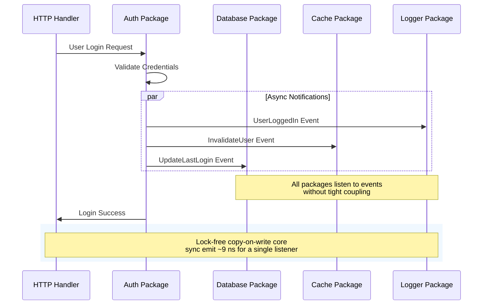

# Signals: Robust, High-Performance Event Processing for Go

> **A lock-free, zero-allocation-read-path event system designed for mission-critical Go applications**

[](https://golang.org)
[](https://github.com/maniartech/signals)
[](https://github.com/maniartech/signals)
[](https://opensource.org/licenses/MIT)

## What is Signals?

**Signals** is a **robust, high-performance Go library** for **in-process event communication** within monolithic Go applications. Built around a **lock-free, copy-on-write** core, it enables decoupled communication between **packages and components within the same process**. The synchronous read path performs a **single atomic load** with **zero allocations** — no lock, no copy, no garbage — while async dispatch trades that for goroutine-per-listener fan-out.

### Architecture Scope
- ✅ **In-Process Communication**: Perfect for monolithic Go applications
- ✅ **Package Coordination**: Events between Go packages in same binary
- ✅ **Component Decoupling**: Loose coupling within single application
- ❌ **NOT for Distributed Systems**: Use message brokers for microservices

```go
// Synchronous, in-caller-goroutine event processing
signal := signals.NewSync[UserEvent]()
signal.AddListener(func(ctx context.Context, user UserEvent) {
    analytics.Track(user.ID, "signup")
})

// Sync emit: single atomic load, ~9 ns, 0 allocs for one listener
signal.Emit(ctx, UserEvent{ID: "user123", Action: "signup"})
```

## Performance Benchmarks

Measured on an **AMD Ryzen 7 5700G (Windows)** with `go test -count=6`. Reproduce with:

```bash
go test -run '^$' -bench=. -benchmem -count=6 ./tests/
```

### Sync — zero-allocation read path

| Operation | Time | Memory | Allocations |
|-----------|------|--------|-------------|
| **Emit, 1 listener** | `~9 ns/op` | `0 B` | `0 allocs` ✅ |
| **Emit, 10 listeners** | `~39 ns/op` | `0 B` | `0 allocs` ✅ |
| **Concurrent emit** | `~1.3 ns/op` | `0 B` | `0 allocs` ✅ |
| **TryEmit, 1 listener** | `~11 ns/op` | `0 B` | `0 allocs` ✅ |
| **Error → OnError** | `~20 ns/op` | `0 B` | `0 allocs` ✅ |

### Async — dispatch rate (goroutine spawn, not completion)

| Operation | Time | Memory |
|-----------|------|--------|
| **Emit, 1 listener** (fire-and-forget dispatch) | `~260 ns/op` | `208 B / 2 allocs` |
| **Emit, 100 listeners** (dispatch) | `~28 µs/op` | `~11 KB` |
| **TryEmit waited, 10 listeners** | `~6.5 µs/op` | — |
| **TryEmit waited, bounded (MaxConcurrent=4)** | `~9.2 µs/op` | — |

> Async `Emit` numbers measure **dispatch rate** — the cost of spawning a goroutine per listener — not the time for listeners to complete. Bounded dispatch is intentionally slower: `MaxConcurrent` is a safety valve, not a speed-up.

> 🎖️ **Proven under fire**: validated with the race detector, fuzzing, and stress tests — e.g. 100 goroutines × 1000 operations under `go test -race`.

## Key Features

### 🔥 **High-Performance Sync Read Path**
- **Single atomic load** on the read path — no lock, no copy
- **Zero allocations** for synchronous emit
- **Lock-free copy-on-write**: an immutable listener slice behind `atomic.Pointer`
- Writers serialize on a write-mutex and publish a new slice (O(n) writes)

### Robust by Construction
- **Race-condition free** read path — lock-free atomic loads, validated with `go test -race`
- **Context-aware operations** - All listeners receive context for cancellation and timeouts
- **Error propagation** with fast-failing patterns via `AddListenerWithErr` and `OnError` (available on **both** sync and async signals)
- **93.5% test coverage** including edge cases and stress tests

### Enterprise Architecture
- **Generic type safety** with compile-time validation
- **Sync vs Async** separation with distinct dispatch semantics
- **Interface compliance** for dependency injection
- **Backward compatibility** with semantic versioning

### Production Ready
- **Dependency-free** - Zero external dependencies
- **No background goroutines or pools** - sync emits run inline; async spawns goroutines on demand
- **Optional concurrency cap** via `SignalOptions.MaxConcurrent` (unbounded by default)
- **Comprehensive documentation** with real-world examples

## Package Communication Flow


```mermaid
sequenceDiagram
    participant HTTP as HTTP Handler
    participant Auth as Auth Package
    participant DB as Database Package
    participant Cache as Cache Package
    participant Logger as Logger Package

    HTTP->>Auth: User Login Request
    Auth->>Auth: Validate Credentials

    par Async Notifications
        Auth->>Logger: UserLoggedIn Event
        Auth->>Cache: InvalidateUser Event
        Auth->>DB: UpdateLastLogin Event
    end

    Note over Logger,DB: All packages listen to events<br/>without tight coupling

    Auth->>HTTP: Login Success

    rect rgb(240, 248, 255)
        Note over HTTP,Logger: Lock-free copy-on-write core<br/>sync emit ~9 ns for a single listener
    end
```

## 🌟 Core Design Philosophy

### **1. Lock-Free, Zero-Allocation Reads**
The listener set is an immutable slice held behind `atomic.Pointer`. Emitting
loads it with a single atomic read and iterates — no lock, no copy, no
allocation. Subscribing or removing a listener serializes on a write-mutex and
publishes a brand-new slice (copy-on-write), so reads never block writes.

```go
// Read path: one atomic load, then iterate — no locks, no allocs.
subscribers := s.subscribers.Load()
for _, sub := range *subscribers {
    sub.listener(ctx, payload)
}
```

### **2. Robust Concurrency**
- **Lock-free read path** via `atomic.Pointer` (no RWMutex, no worker pool)
- **Copy-on-write writers** serialized by a single write-mutex
- **Adversarial testing** under the race detector, fuzzing, and stress loops
- **Context cancellation** for graceful degradation (available in both signal types)

### **3. Type Safety First**
- **Generic constraints** prevent runtime type errors
- **Interface segregation** - sync vs async capabilities
- **Compile-time validation** of event payloads
- **Clear API boundaries** with semantic naming

## Real-World Use Cases

### **Cross-Package Communication**
```go
// events/signals.go - Global event coordination
var UserUpdated = signals.New[UserEvent]()

// auth/service.go - Auth package reacts to user changes
func init() {
    events.UserUpdated.AddListener(func(ctx context.Context, user UserEvent) {
        tokenStore.InvalidateUser(user.ID)  // Clear auth tokens
    }, "auth-invalidation")
}

// cache/service.go - Cache package reacts to same event
func init() {
    events.UserUpdated.AddListener(func(ctx context.Context, user UserEvent) {
        cache.InvalidateUserData(user.ID)  // Clear cached data
    }, "cache-invalidation")
}
```

### **Database Transaction Control**
```go
// Synchronous transaction validation across packages
txSignal := signals.NewSync[TransactionEvent]()
txSignal.AddListenerWithErr(audit.ValidatePermissions)
txSignal.AddListenerWithErr(business.ValidateRules)

// Cancel transaction if any validator fails
if err := txSignal.TryEmit(ctx, txEvent); err != nil {
    tx.Rollback()  // Automatic rollback on validation failure
    return err
}
tx.Commit()
```

### Request Logging & Analytics
```go
// HTTP middleware emits request events
var RequestLogged = signals.New[RequestEvent]()

// Multiple packages listen for request events
logger.Listen()     // logs/service.go logs requests
analytics.Listen()  // analytics/service.go tracks patterns
metrics.Listen()    // metrics/service.go measures performance

// Async fire-and-forget dispatch (goroutine per listener)
RequestLogged.Emit(ctx, RequestEvent{Path: "/api/users", Duration: 23})
```

### **Change History Tracking**
```go
// Track database changes across the application
var DataChanged = signals.New[ChangeEvent]()

// history/service.go automatically tracks all changes
func init() {
    DataChanged.AddListener(func(ctx context.Context, change ChangeEvent) {
        history.Record(change.Table, change.Before, change.After)
    }, "change-tracker")
}

// Any package can emit change events
DataChanged.Emit(ctx, ChangeEvent{Table: "users", RecordID: "123"})
```

## 📚 Documentation Navigation

| **Section** | **Description** | **Audience** |
|-------------|-----------------|--------------|
| **[▶ Getting Started](getting_started.md)** | Quick setup, basic examples, installation | **Beginners** |
| **[💡 Core Concepts](concepts.md)** | Sync vs Async, patterns, best practices | **All Users** |
| **[🏗️ Architecture](architecture.md)** | Internal design, lock-free copy-on-write core | **Advanced** |
| **[📖 API Reference](api_reference.md)** | Complete method documentation with examples | **Reference** |

## Production Confidence

### **Proven Correctness**
- ✅ **Lock-free read path** validated under the race detector across stress loops
- ✅ **Proof gauntlet**: race + fuzz + stress (e.g. 100 goroutines × 1000 operations under `go test -race`)
- ✅ **Zero allocations** on the synchronous emit path
- ✅ **Backward compatible** - seamless upgrades from v1.0.0+

### **Common Use Cases**
Perfect for:
- **Package coordination** (cross-package event handling)
- **HTTP middleware** (request logging, authentication, rate limiting)
- **Database operations** (transaction validation, change tracking)
- **Cache management** (invalidation coordination)
- **Background processing** (async task coordination)

> **🏅 Status: PRODUCTION READY** - Proven correct under the v1.4 race + fuzz + stress gauntlet

---

**Ready to get started?** → [**Start Here**](getting_started.md) ▶
